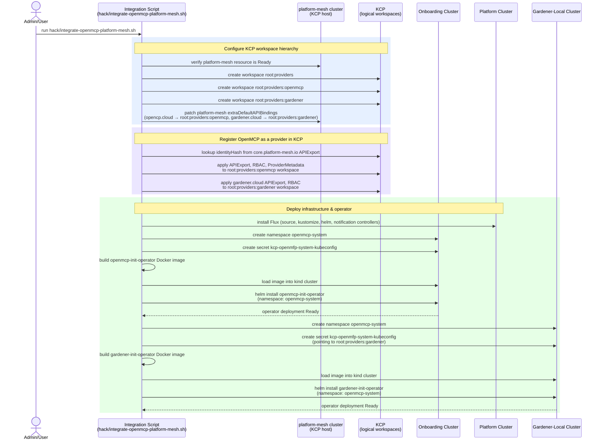
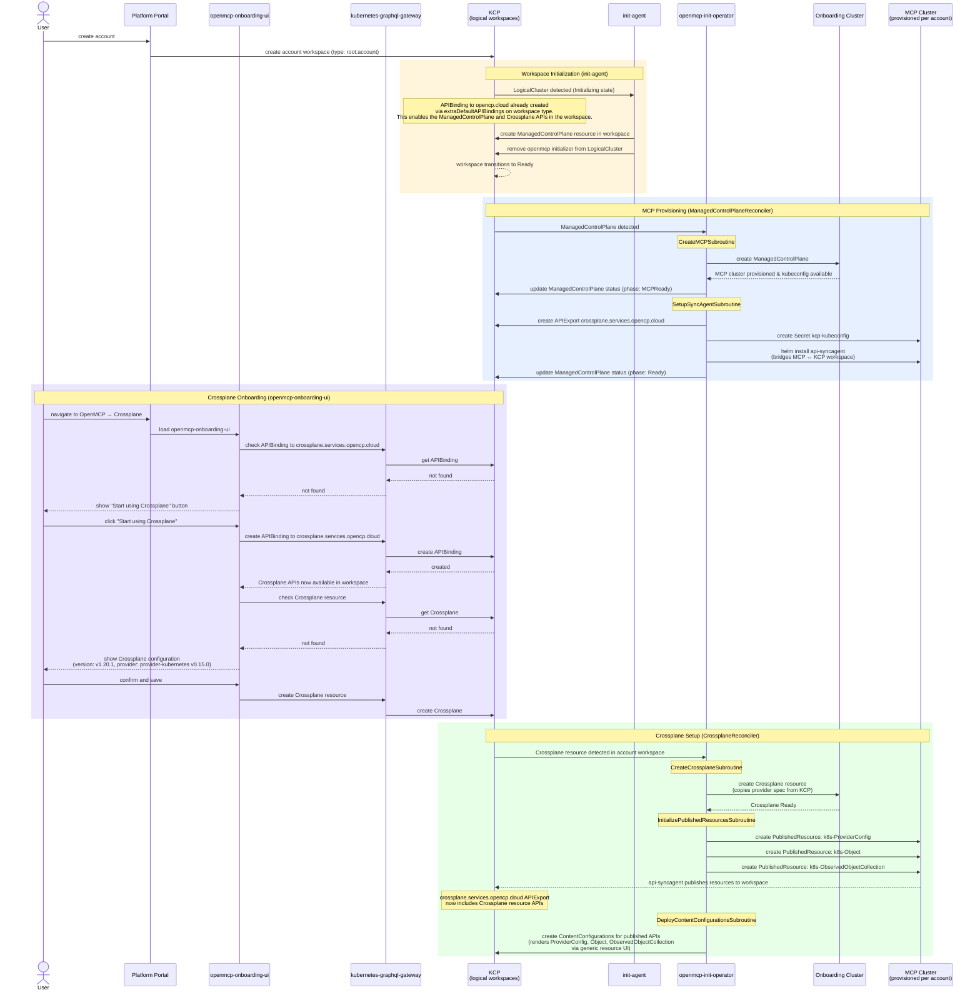
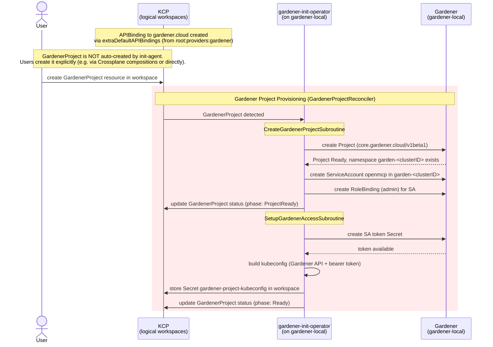
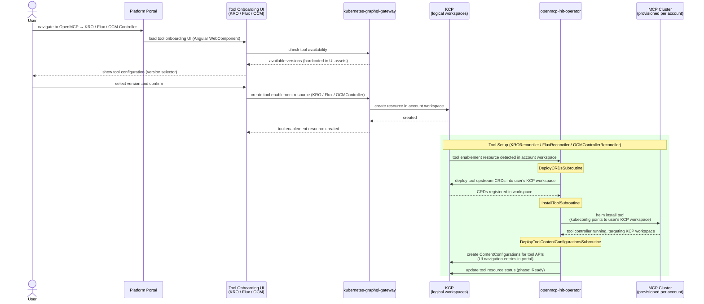

[](https://platform-mesh.io)

[](https://api.reuse.software/info/github.com/openmcp-project/local-event-showcase)

# local-event-showcase

> **Disclaimer:** The content of this repository is purely meant for showcase and demonstration purposes. It is not recommended for production use.

This repository contains scripts and documentation for setting up a local platform combining **Gardener**, **OpenMCP**, and **Platform Mesh** — suitable for conferences, events, and development demos.

The demo wires together an OpenMCP onboarding cluster with a [Platform Mesh](https://platform-mesh.io) KCP installation so that every new account workspace gets a dedicated MCP instance. Users onboard tools (Crossplane, KRO, Flux, OCM Controller) through dedicated UIs that guide them through activation and configuration.

### Related Projects

| Project | Documentation |
|---------|---------------|
| **Platform Mesh** | [platform-mesh.io](https://platform-mesh.io) |
| **OpenMCP** | [openmcp-project.io](https://openmcp-project.io) |
| **Gardener** | [gardener.cloud](https://gardener.cloud) |

---

## Requirements

- A machine with at least **8 CPU Cores** and **32 GB RAM** (120 GB+ disk space for Docker)
- [Docker](https://docs.docker.com/get-docker/) (>= 29.x) — with at least 8 CPUs and 8 GB memory allocated
- [kind](https://kind.sigs.k8s.io/)
- [Task](https://taskfile.dev/)
- [Helm](https://helm.sh/)
- [Flux CLI](https://fluxcd.io/flux/cmd/)
- [OCM CLI](https://ocm.software/)
- [kubectl](https://kubernetes.io/docs/tasks/tools/)
- [kubectl-kcp plugin](https://docs.kcp.io/kcp/main/setup/kubectl-plugin/) — for KCP workspace management
- [mkcert](https://github.com/FiloSottile/mkcert) — for generating local SSL certificates (required by Platform Mesh)
- [openssl](https://www.openssl.org/) — typically pre-installed on macOS/Linux
- [Go](https://go.dev/) and [Make](https://www.gnu.org/software/make/) — required for building Gardener locally

> **Note:** The setup involves multiple kind clusters and local builds. See the upstream documentation for additional requirements:
> - [Platform Mesh local setup](https://github.com/platform-mesh/helm-charts/tree/main/local-setup)
> - [Gardener local setup](https://gardener.cloud/docs/gardener/deployment/getting_started_locally/)

---

## Setup Instructions

0. **Delete any existing kind clusters** that could conflict with this setup:
   ```bash
   task delete-clusters
   ```
   > **Warning:** This deletes **all** kind clusters on your machine. If you have other kind clusters you want to keep, skip this step and manually delete only the conflicting ones (`platform`, `platform-mesh`, `gardener-local`).

1. **Create the shared kind Docker network** with ICC enabled (required once, before any cluster setup):
   ```bash
   task kind-network
   ```
   > Docker >= 29.x defaults ICC (inter-container communication) to `false` on user-created bridge networks. Without this, containers on the kind network cannot talk to each other, breaking DNS resolution and registry caches.

   The task is idempotent — if the `kind` network already exists with ICC enabled, it's a no-op. If the network exists **without** ICC, the task will fail and ask you to recreate it.

2. **Download the OpenMCP distro** (takes longer, run when necessary):
   ```bash
   task openmcp:clone-distro
   ```

3. **Set up Gardener, Platform Mesh, OpenMCP, and run the integration**:
   ```bash
   task gardener:local platform-mesh:local openmcp:local integrate
   ```

   This single command:
   - Clones Gardener into `demo/external/gardener`, creates a `gardener-local` kind cluster, and starts Gardener
   - Checks out Platform Mesh helm-charts and creates the `platform-mesh` kind cluster with KCP
   - Creates the `platform` kind cluster with Flux, mirrors Crossplane artifacts to the local registry, and deploys OpenMCP
   - Runs the integration script that wires everything together (KCP workspaces, operators, init-agent)

### After Setup

Once the setup completes, you have a running platform with the following kind clusters:

| Cluster | Purpose |
|---------|---------|
| `platform` | Core OpenMCP infrastructure (Flux, openmcp-operator) |
| `platform-mesh` | Runs KCP and the platform portal |
| `gardener-local` | Runs Gardener and the gardener-init-operator |
| `onboarding.*` | Hosts the openmcp-init-operator (created dynamically) |
| `mcp-worker-*` | MCP clusters provisioned per account workspace |

### Useful Tasks

| Task | Description |
|------|-------------|
| `task openmcp:create-mcp` | Manually create an MCP with Crossplane in an account workspace |
| `task openmcp:local:iterate` | Re-render and re-apply openmcp manifests (skips cluster creation) |
| `task platform-mesh:local:iterate` | Update platform-mesh without full rebuild |
| `task deploy-ui` | Build and redeploy only the onboarding UI |
| `task openmcp:export-onboarding-kubeconfig` | Export the onboarding cluster kubeconfig |
| `task openmcp:export-mcp-kubeconfig` | Export the MCP worker cluster kubeconfig |
| `task install-flux` | Install Flux on all MCP worker clusters |
| `task delete-clusters` | Delete all kind clusters |

---

## Architecture

### Preconditions

The following must be in place before running the integration:

| Component | Description |
|-----------|-------------|
| `platform` kind cluster | Core OpenMCP infrastructure (Flux installed during integration) |
| `onboarding` kind cluster | Hosts the `openmcp-init-operator` |
| `platform-mesh` kind cluster | Runs KCP and the platform portal |
| `platform-mesh` resource | Must be in `Ready` state inside the `platform-mesh` cluster |
| `gardener-local` kind cluster | Runs Gardener and the `gardener-init-operator` (local setup via `hack/setup-gardener-local.sh`) |

### 1. Installation Phase (one-time setup)



### 2. Usage Phase (per new account workspace)



### 3. Gardener Provisioning Phase (user-driven per account workspace)



### 4. Tool Provisioning Phase (KRO, Flux, OCM Controller)



---

## Key Participants

| Participant | Role |
|-------------|------|
| **Integration Script** | One-time bootstrap: creates KCP workspaces, deploys operator, wires platform-mesh |
| **KCP** | Multi-tenant control plane; hosts logical workspaces, ManagedControlPlane, and Crossplane resources per account |
| **platform-mesh cluster** | Runs KCP and the platform portal; owns the `platform-mesh` resource |
| **init-agent** | Watches LogicalClusters, creates ManagedControlPlane resource per workspace (no longer creates GardenerProject) |
| **openmcp-init-operator** | Reconciles ManagedControlPlane, Crossplane, KRO, Flux, and OCMController resources |
| **openmcp-onboarding-ui** | Angular micro-frontend: guides users through Crossplane, KRO, Flux, and OCM Controller activation and configuration |
| **Onboarding Cluster** | Hosts the `openmcp-init-operator` and `ManagedControlPlane` resources |
| **MCP Cluster** | Provisioned per account; runs Crossplane, tool controllers, and the KCP api-syncagent |
| **Platform Cluster** | Core OpenMCP infrastructure; Flux is installed here during setup |
| **gardener-init-operator** | Reconciles GardenerProject resources: creates Gardener projects, sets up access. Runs on gardener-local cluster. |
| **Gardener (gardener-local)** | Local Gardener installation; provides project-based resource isolation |

---

## Architecture Notes

- The **init-agent** is the [KCP init-agent](https://github.com/kcp-dev/init-agent), deployed by platform-mesh. It is configured via `InitTemplate` and `InitTarget` resources to create a `ManagedControlPlane` resource in each new account workspace. It does **not** create GardenerProject resources — those are user-driven.
- The **openmcp-init-operator** reconciles `ManagedControlPlane`, `Crossplane`, `KRO`, `Flux`, and `OCMController` resources. It runs on the onboarding cluster.
- The **gardener-init-operator** reconciles `GardenerProject` resources. It uses `unstructured.Unstructured` to interact with the Gardener API to avoid pulling in the massive Gardener Go dependency tree. It runs on the **gardener-local** cluster (not the onboarding cluster), giving it direct access to the Gardener API via in-cluster config.
- Gardener is an **independent provider** with its own KCP workspace (`root:providers:gardener`) and APIExport (`gardener.cloud`). This decouples Gardener from the OpenMCP provider workspace.
- `ManagedControlPlane` is the domain resource that triggers MCP provisioning. It carries status phases (`MCPReady`, `Ready`) giving clear visibility into provisioning progress.
- The **openmcp-onboarding-ui** is an Angular micro-frontend with web components for each tool. It detects Crossplane state by checking for the APIBinding to `crossplane.services.opencp.cloud` and the existence of a `Crossplane` resource. It drives a two-step onboarding: activate the tool (creates APIBinding or enablement resource), then configure it.
- Crossplane onboarding is **user-driven** — the operator does not create Crossplane resources automatically. The UI creates the APIBinding and Crossplane resource based on user choices.
- After Crossplane is ready and PublishedResources are created, the api-syncagent adds the published Crossplane resource APIs (ProviderConfig, Object, ObservedObjectCollection) to the `crossplane.services.opencp.cloud` APIExport, making them available in the workspace.
- Network routing from MCP clusters to KCP uses `hostAliases` to map `localhost` to the `platform-mesh` Docker container IP, since KCP listens on `localhost:31000` (NodePort) inside the kind network.
- Published resources (`ProviderConfig`, `Object`, `ObservedObjectCollection`) are only initialized once the target Crossplane on the onboarding cluster reports all `*Ready` conditions as `True`.
- **Crossplane vs. KRO/Flux/OCM architecture**: Crossplane uses a sync-agent bridge — the `api-syncagent` runs on the MCP cluster and bridges resources between KCP and MCP via a dynamic `crossplane.services.opencp.cloud` APIExport. KRO, Flux, and OCM Controller use a simpler direct pattern: the operator deploys the tool's upstream CRDs directly into the user's KCP workspace, then installs the tool controller on the MCP cluster with a kubeconfig that points at that KCP workspace. The tool controller reconciles against KCP directly, with no sync-agent in between.
- Each tool API group is a separate KCP service domain: `kro.services.opencp.cloud`, `flux.services.opencp.cloud`, and `ocm.services.opencp.cloud`. All three are published via the existing `opencp.cloud` APIExport.

---

## Support, Feedback, Contributing

This project is open to feature requests/suggestions, bug reports etc. via [GitHub issues](https://github.com/openmcp-project/local-event-showcase/issues). Contribution and feedback are encouraged and always welcome. For more information about how to contribute, the project structure, as well as additional contribution information, see our [Contribution Guidelines](CONTRIBUTING.md).

## Security / Disclosure
If you find any bug that may be a security problem, please follow our instructions at [in our security policy](https://github.com/openmcp-project/local-event-showcase/security/policy) on how to report it. Please do not create GitHub issues for security-related doubts or problems.

## Code of Conduct

We as members, contributors, and leaders pledge to make participation in our community a harassment-free experience for everyone. By participating in this project, you agree to abide by its [Code of Conduct](https://github.com/SAP/.github/blob/main/CODE_OF_CONDUCT.md) at all times.

## Licensing

Copyright 2026 SAP SE or an SAP affiliate company and local-event-showcase contributors. Please see our [LICENSE](LICENSE) for copyright and license information. Detailed information including third-party components and their licensing/copyright information is available [via the REUSE tool](https://api.reuse.software/info/github.com/openmcp-project/local-event-showcase).
