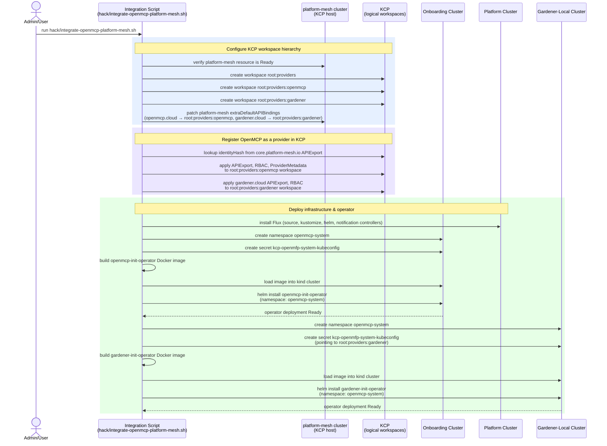
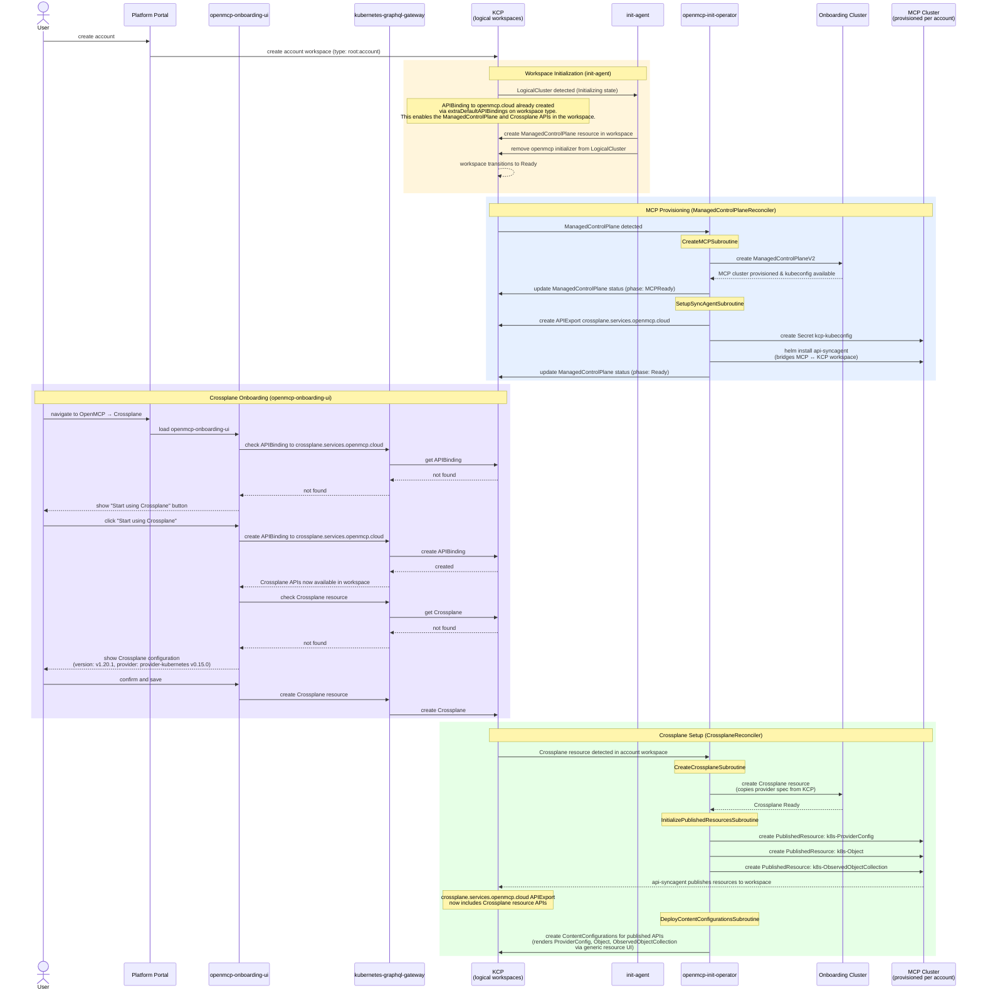
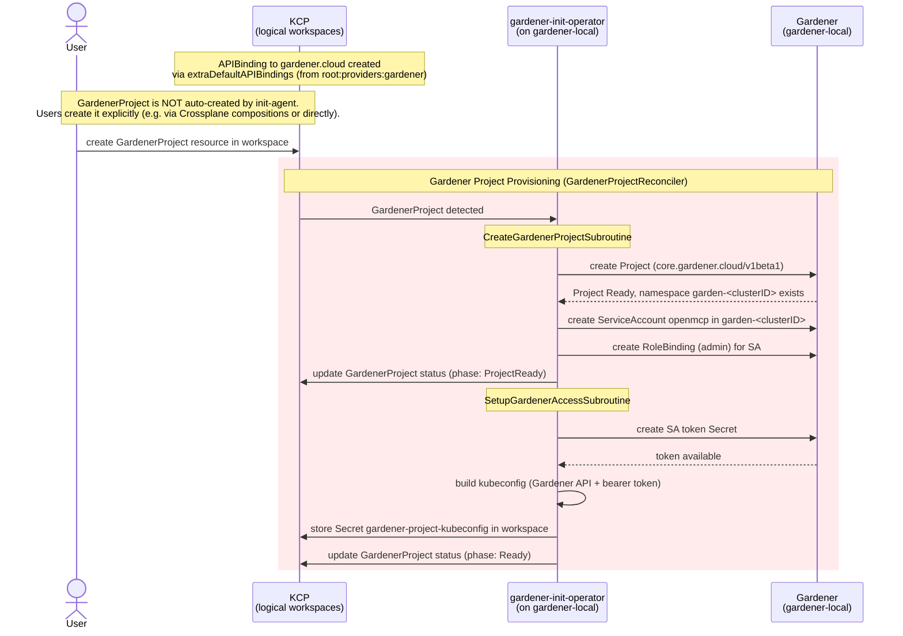
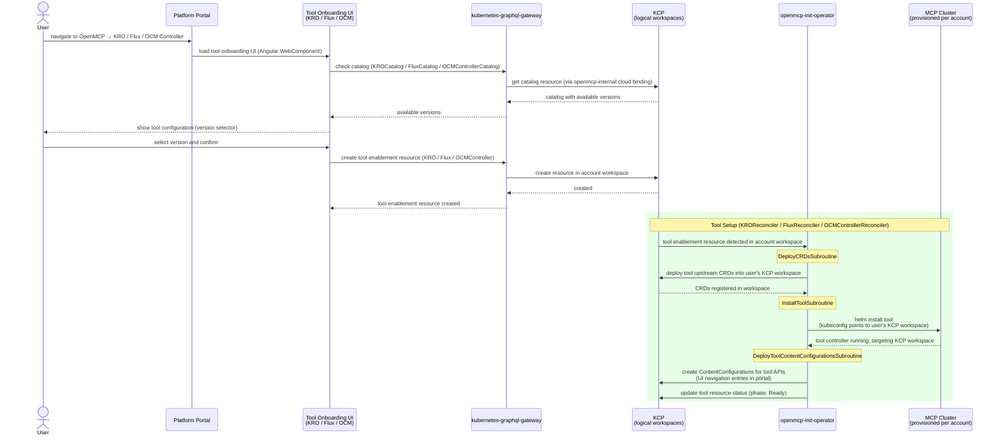

# OpenMCP + Platform-Mesh Integration — Concept

This document describes the end-to-end flow of the `local-event-showcase` demo project. The demo wires together an OpenMCP onboarding cluster with a [platform-mesh](https://platform-mesh.io) KCP installation so that every new account workspace gets a dedicated MCP instance. Users onboard Crossplane through a dedicated UI (`openmcp-onboarding-ui`) that guides them through activation and configuration.

## Preconditions

The following must be in place before running the integration:

| Component | Description |
|-----------|-------------|
| `platform` kind cluster | Core OpenMCP infrastructure (Flux installed during integration) |
| `onboarding` kind cluster | Hosts the `openmcp-init-operator` |
| `platform-mesh` kind cluster | Runs KCP and the platform portal |
| `platform-mesh` resource | Must be in `Ready` state inside the `platform-mesh` cluster |
| `gardener-local` kind cluster | Runs Gardener and the `gardener-init-operator` (local setup via `hack/setup-gardener-local.sh`) |

---

## 1. Installation Phase (one-time setup)

---

## 2. Usage Phase (per new account workspace)

---

## 3. Gardener Provisioning Phase (user-driven per account workspace)

---

## 4. Tool Provisioning Phase (KRO, Flux, OCM Controller)

---

## Key Participants

| Participant | Role |
|-------------|------|
| **Integration Script** | One-time bootstrap: creates KCP workspaces, deploys operator, wires platform-mesh |
| **KCP** | Multi-tenant control plane; hosts logical workspaces, ManagedControlPlane, and Crossplane resources per account |
| **platform-mesh cluster** | Runs KCP and the platform portal; owns the `platform-mesh` resource |
| **init-agent** | Watches LogicalClusters, creates ManagedControlPlane resource per workspace (no longer creates GardenerProject) |
| **openmcp-init-operator** | Reconciles ManagedControlPlane and Crossplane resources |
| **openmcp-onboarding-ui** | Luigi micro-frontend: guides users through Crossplane activation and configuration |
| **KRO / Flux / OCM Onboarding UI** | Angular WebComponent micro-frontends: guide users through KRO, Flux, and OCM Controller activation and version selection |
| **KRO / Flux / OCM Controller** | Tool controllers running on the MCP cluster; reconcile against the user's KCP workspace directly via kubeconfig (no sync-agent) |
| **Onboarding Cluster** | Hosts the `openmcp-init-operator` and `ManagedControlPlaneV2` resources |
| **MCP Cluster** | Provisioned per account; runs Crossplane and the KCP api-syncagent |
| **Platform Cluster** | Core OpenMCP infrastructure; Flux is installed here during Phase 1 |
| **gardener-init-operator** | Reconciles GardenerProject resources: creates Gardener projects, sets up access. Runs on gardener-local cluster. |
| **Gardener (gardener-local)** | Local Gardener installation; provides project-based resource isolation. Hosts the gardener-init-operator. |

---

## Notes

- The `init-agent` is the [KCP init-agent](https://github.com/kcp-dev/init-agent), deployed by platform-mesh. It is configured via `InitTemplate` and `InitTarget` resources to create a `ManagedControlPlane` resource in each new account workspace. It does **not** create GardenerProject resources — those are user-driven.
- The `openmcp-init-operator` reconciles `ManagedControlPlane` and `Crossplane` resources. It runs on the onboarding cluster.
- The `gardener-init-operator` reconciles `GardenerProject` resources. It uses `unstructured.Unstructured` to interact with the Gardener API to avoid pulling in the massive Gardener Go dependency tree. It runs on the **gardener-local** cluster (not the onboarding cluster), giving it direct access to the Gardener API via in-cluster config.
- Gardener is an **independent provider** with its own KCP workspace (`root:providers:gardener`) and APIExport (`gardener.cloud`). This decouples Gardener from the OpenMCP provider workspace.
- `ManagedControlPlane` is the domain resource that triggers MCP provisioning. It carries status phases (`MCPReady`, `Ready`) giving clear visibility into provisioning progress.
- The `openmcp-onboarding-ui` is a Luigi micro-frontend under the OpenMCP → Crossplane navigation node. It detects Crossplane state by checking for the APIBinding to `crossplane.services.openmcp.cloud` and the existence of a `Crossplane` resource. It drives a two-step onboarding: activate Crossplane (creates APIBinding), then configure it (creates Crossplane resource).
- Crossplane onboarding is **user-driven** — the operator does not create Crossplane resources automatically. The UI creates the APIBinding and Crossplane resource based on user choices.
- After Crossplane is ready and PublishedResources are created, the api-syncagent adds the published Crossplane resource APIs (ProviderConfig, Object, ObservedObjectCollection) to the `crossplane.services.openmcp.cloud` APIExport, making them available in the workspace.
- Network routing from MCP clusters to KCP uses `hostAliases` to map `localhost` to the `platform-mesh` Docker container IP, since KCP listens on `localhost:31000` (NodePort) inside the kind network.
- Published resources (`ProviderConfig`, `Object`, `ObservedObjectCollection`) are only initialized once the target Crossplane on the onboarding cluster reports all `*Ready` conditions as `True`.
- **Crossplane vs. KRO/Flux/OCM architecture**: Crossplane uses a sync-agent bridge — the `api-syncagent` runs on the MCP cluster and bridges resources between KCP and MCP via a dynamic `crossplane.services.openmcp.cloud` APIExport. KRO, Flux, and OCM Controller use a simpler direct pattern: the operator deploys the tool's upstream CRDs directly into the user's KCP workspace, then installs the tool controller on the MCP cluster with a kubeconfig that points at that KCP workspace. The tool controller reconciles against KCP directly, with no sync-agent in between.
- Catalog resources (`KROCatalog`, `FluxCatalog`, `OCMControllerCatalog`) are published via the `openmcp-internal.cloud` APIExport and are intended to be replicated via `CachedResource` (read-only, provider-managed). CachedResources are currently non-functional; catalog data is hardcoded in the onboarding UI assets until the feature is fixed.
- Each new tool API group is a separate KCP service domain: `kro.services.openmcp.cloud`, `flux.services.openmcp.cloud`, and `ocm.services.openmcp.cloud`. All three are published via the existing `openmcp.cloud` APIExport (enablement resources) and `openmcp-internal.cloud` APIExport (catalog resources).

---

## Implementation Plan

Each phase is independently deployable and verifiable before moving to the next.

### Phase 1 — ManagedControlPlane CRD & Operator Refactor

**Goal:** Replace the APIBinding-triggered reconciliation with a `ManagedControlPlane` custom resource.

**Changes:**
- Define `ManagedControlPlane` CRD in `api/core/v1alpha1/` with spec (empty for now) and status (phase: `Provisioning`, `MCPReady`, `Ready`; conditions)
- Create `ManagedControlPlaneReconciler` replacing `OpenMCPInitReconciler` — watches `ManagedControlPlane` instead of `APIBinding`
- Refactor `CreateMCPSubroutine` and `SetupSyncAgentSubroutine` to work against `ManagedControlPlane` instead of `APIBinding`
- Update status phases on the `ManagedControlPlane` resource after each subroutine completes
- Remove `OpenMCPInitReconciler` and the APIBinding watch logic
- Remove `DeployAPIExportBindingSubroutine` and `SetupFluxSubroutine` (dead code)
- Update `SetupSyncAgentSubroutine`: create APIExport as `crossplane.services.openmcp.cloud`, drop ProviderMetadata and ContentConfiguration creation
- Update Helm chart, RBAC markers, and `task generate`
- Update integration script to apply the new `ManagedControlPlane` APIResourceSchema to the provider workspace

**Validate:**
- Deploy to local kind setup
- Manually create a `ManagedControlPlane` resource in a KCP workspace
- Verify MCP is provisioned, sync agent deployed, status phases progress to `Ready`

---

### Phase 2 — KCP Init-Agent Configuration

**Goal:** Use the [KCP init-agent](https://github.com/kcp-dev/init-agent) (already deployed by platform-mesh) to automatically create `ManagedControlPlane` resources when new account workspaces are initialized.

**Changes:**
- Create `InitTemplate` manifest (`demo/manifests/init-agent/init-template.yaml`) that defines a `ManagedControlPlane` resource to be created in each new workspace
- Create `InitTarget` manifest (`demo/manifests/init-agent/init-target.yaml`) that connects the `root:account` workspace type to the `InitTemplate`
- Remove the `initializer` subcommand from `openmcp-init-operator` (replaced by the KCP init-agent)
- Remove `InitializeWorkspaceSubroutine`, `LogicalClusterReconciler`, and `InitializerConfig` from the operator
- Update integration script to apply init-agent manifests to the provider workspace

**Validate:**
- Deploy to local kind setup
- Create a new account workspace in KCP
- Verify: init-agent creates `ManagedControlPlane`, operator picks it up and provisions MCP

---

### Phase 3 — Onboarding UI (openmcp-onboarding-ui)

**Goal:** Build the Luigi micro-frontend that guides users through Crossplane activation.

**Changes:**
- Create `demo/openmcp-onboarding-ui/` — Luigi micro-frontend project
- Page 1: Check for APIBinding to `crossplane.services.openmcp.cloud` via kubernetes-graphql-gateway
  - Not found → show "Start using Crossplane" button
  - Found → proceed to page 2
- Page 2: Show Crossplane configuration (hardcoded: v1.20.1, provider-kubernetes v0.15.0)
  - Check if `Crossplane` resource exists → show status if yes
  - Not found → show "Confirm and save" → create `Crossplane` resource via graphql gateway
- Register as ContentConfiguration in the provider workspace (OpenMCP → Crossplane nav node)
- Update integration script to deploy the UI ContentConfiguration

**Validate:**
- Deploy to local setup
- Navigate to OpenMCP → Crossplane in the portal
- Click "Start using Crossplane" → verify APIBinding created
- Confirm Crossplane config → verify Crossplane resource created
- Verify operator picks up the Crossplane resource and reconciles it

---

### Phase 4 — ContentConfigurations for Published APIs

**Goal:** After Crossplane is ready, deploy ContentConfigurations so published APIs render in the portal via the generic resource UI.

**Changes:**
- Add `DeployContentConfigurationsSubroutine` to `CrossplaneReconciler`
- After `InitializePublishedResourcesSubroutine` completes, create ContentConfigurations in the KCP workspace for:
  - `k8s-ProviderConfig`
  - `k8s-Object`
  - `k8s-ObservedObjectCollection`
- Each ContentConfiguration points to the generic resource UI with the appropriate API group/version/resource

**Validate:**
- End-to-end: create account → init-agent seeds workspace → operator provisions MCP → user activates Crossplane via UI → operator installs Crossplane → published resources appear → ContentConfigurations deployed → resources visible and manageable in portal

---

### Phase 5 — GardenerProject + gardener-init-operator (independent provider)

**Goal:** Gardener is an independent provider with its own KCP workspace (`root:providers:gardener`). The `gardener-init-operator` runs on the `gardener-local` cluster and reconciles `GardenerProject` resources, creating Gardener Projects, ServiceAccounts, and kubeconfig Secrets. GardenerProject resources are **user-driven** — not auto-created by the init-agent.

**Changes:**
- Define `GardenerProject` CRD in `gardener-init-operator/api/v1alpha1/` with status phases (`Provisioning`, `ProjectReady`, `Ready`)
- Create `gardener-init-operator` — new Go operator (`demo/gardener-init-operator/`)
- `CreateGardenerProjectSubroutine`: creates Gardener Project (unstructured), ServiceAccount, RoleBinding
- `SetupGardenerAccessSubroutine`: creates SA token Secret, builds kubeconfig, stores in KCP workspace
- Register `gardener.cloud` APIExport with GardenerProject APIResourceSchema in the `root:providers:gardener` workspace (separate from openmcp)
- No `GardenerProject` InitTemplate — users create GardenerProject explicitly (e.g., via Crossplane compositions or directly)
- Update integration script to:
  - Create `root:providers:gardener` workspace
  - Apply gardener manifests to the gardener workspace (not openmcp)
  - Deploy gardener-init-operator to `gardener-local` cluster (not onboarding)
  - Create KCP kubeconfig secret pointing to `root:providers:gardener`
- Migrate both operators to new golang-commons config pattern (no mapstructure/viper)

**Validate:**
- `gardener.cloud` APIExport exists in `root:providers:gardener` workspace (not in openmcp)
- New account workspace has APIBindings to both `openmcp.cloud` (from `root:providers:openmcp`) and `gardener.cloud` (from `root:providers:gardener`)
- Init-agent creates only `ManagedControlPlane` (no auto-created GardenerProject)
- Manually create a `GardenerProject` in an account workspace — gardener-init-operator (on gardener-local) picks it up
- gardener-init-operator provisions Gardener Project, SA, kubeconfig
- `kubectl get gardenerprojects` → `Phase: Ready`
- `kubectl get secret gardener-project-kubeconfig` exists in workspace

---

### Phase 6 — KRO, Flux, OCM Controller Tools

**Goal:** Extend the demo with three new tools — KRO, Flux, and OCM Controller — following a direct CRD + controller-on-MCP pattern (no sync-agent). Each tool has a user-facing onboarding UI, a catalog resource for version discovery, and three operator subroutines.

**Changes:**
- Define new API groups in `openmcp-init-operator/api/`:
  - `kro.services.openmcp.cloud`: `KRO` (enablement), `KROCatalog` (version catalog)
  - `flux.services.openmcp.cloud`: `Flux` (enablement), `FluxCatalog` (version catalog)
  - `ocm.services.openmcp.cloud`: `OCMController` (enablement), `OCMControllerCatalog` (version catalog)
- Add `KROReconciler`, `FluxReconciler`, `OCMControllerReconciler` to `openmcp-init-operator`; each reconciler runs three subroutines:
  - `DeployCRDsSubroutine`: deploy the tool's upstream CRDs directly into the user's KCP workspace
  - `InstallToolSubroutine`: Helm install the tool controller on the MCP cluster with a kubeconfig targeting the user's KCP workspace
  - `DeployToolContentConfigurationsSubroutine`: create ContentConfiguration resources in the KCP workspace for portal navigation
- Register new `APIResourceSchemas` for all six types in the `root:providers:openmcp` workspace; publish enablement types via the existing `openmcp.cloud` APIExport and catalog types via `openmcp-internal.cloud` APIExport
- Create `CachedResource` manifests for catalog types (replicate catalog data to KCP cache; currently non-functional — catalog data is hardcoded in UI assets as a workaround)
- Create catalog instance manifests (`KROCatalog`, `FluxCatalog`, `OCMControllerCatalog`) in the provider workspace
- Add Angular WebComponent onboarding UIs (`kro-onboarding`, `flux-onboarding`, `ocm-onboarding`) to `openmcp-onboarding-ui`:
  - Read catalog resource to populate version selector
  - Create enablement resource (`KRO` / `Flux` / `OCMController`) on confirmation
- Update integration script to apply new manifests and register new ContentConfigurations

**Validate:**
- New `APIResourceSchemas` and updated `openmcp.cloud` / `openmcp-internal.cloud` APIExports are present in `root:providers:openmcp`
- Navigate to portal → OpenMCP → KRO (/ Flux / OCM Controller) → onboarding UI loads, version selector populated
- Confirm selection → enablement resource created in account workspace
- Operator picks up resource → DeployCRDs runs (CRDs visible in KCP workspace) → InstallTool runs (tool controller running on MCP, targeting KCP) → DeployToolContentConfigurations runs (ContentConfigurations visible in workspace)
- Tool resource status reaches `Phase: Ready`
- Portal navigation entries for tool APIs appear
