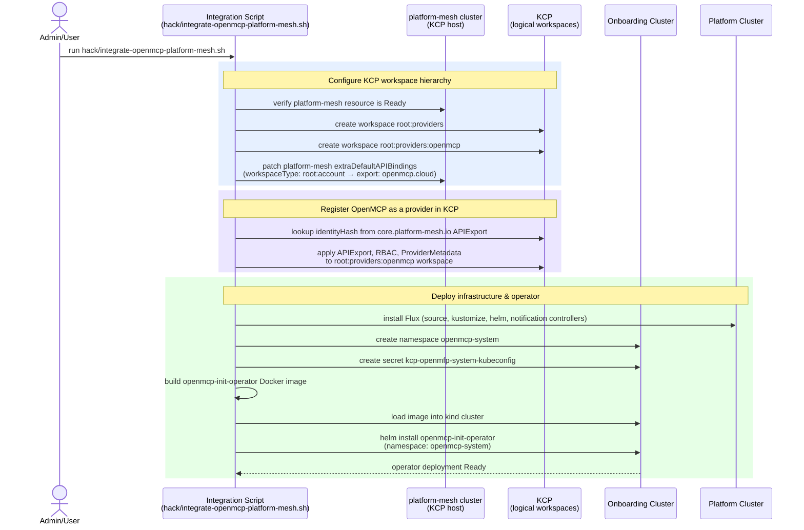
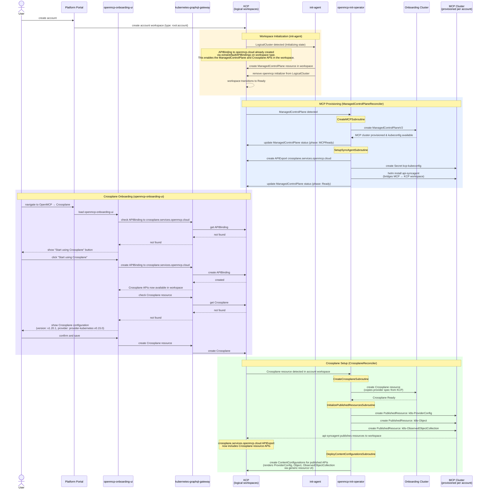

# OpenMCP + Platform-Mesh Integration — Concept

This document describes the end-to-end flow of the `local-event-showcase` demo project. The demo wires together an OpenMCP onboarding cluster with a [platform-mesh](https://platform-mesh.io) KCP installation so that every new account workspace gets a dedicated MCP instance. Users onboard Crossplane through a dedicated UI (`openmcp-onboarding-ui`) that guides them through activation and configuration.

## Preconditions

The following must be in place before running the integration:

| Component | Description |
|-----------|-------------|
| `platform` kind cluster | Core OpenMCP infrastructure (Flux installed during integration) |
| `onboarding` kind cluster | Hosts the `openmcp-init-operator` |
| `platform-mesh` kind cluster | Runs KCP and the platform portal |
| `platform-mesh` resource | Must be in `Ready` state inside the `platform-mesh` cluster |

---

## 1. Installation Phase (one-time setup)

---

## 2. Usage Phase (per new account workspace)

---

## Key Participants

| Participant | Role |
|-------------|------|
| **Integration Script** | One-time bootstrap: creates KCP workspaces, deploys operator, wires platform-mesh |
| **KCP** | Multi-tenant control plane; hosts logical workspaces, ManagedControlPlane, and Crossplane resources per account |
| **platform-mesh cluster** | Runs KCP and the platform portal; owns the `platform-mesh` resource |
| **init-agent** | Watches LogicalClusters, creates ManagedControlPlane resource per workspace |
| **openmcp-init-operator** | Reconciles ManagedControlPlane and Crossplane resources |
| **openmcp-onboarding-ui** | Luigi micro-frontend: guides users through Crossplane activation and configuration |
| **Onboarding Cluster** | Hosts the `openmcp-init-operator` and `ManagedControlPlaneV2` resources |
| **MCP Cluster** | Provisioned per account; runs Crossplane and the KCP api-syncagent |
| **Platform Cluster** | Core OpenMCP infrastructure; Flux is installed here during Phase 1 |

---

## Notes

- The `init-agent` is the [KCP init-agent](https://github.com/kcp-dev/init-agent), deployed by platform-mesh. It is configured via `InitTemplate` and `InitTarget` resources to create a `ManagedControlPlane` resource in each new account workspace.
- The `openmcp-init-operator` reconciles `ManagedControlPlane` and `Crossplane` resources. It runs on the onboarding cluster.
- `ManagedControlPlane` is the domain resource that triggers MCP provisioning. It carries status phases (`MCPReady`, `Ready`) giving clear visibility into provisioning progress.
- The `openmcp-onboarding-ui` is a Luigi micro-frontend under the OpenMCP → Crossplane navigation node. It detects Crossplane state by checking for the APIBinding to `crossplane.services.openmcp.cloud` and the existence of a `Crossplane` resource. It drives a two-step onboarding: activate Crossplane (creates APIBinding), then configure it (creates Crossplane resource).
- Crossplane onboarding is **user-driven** — the operator does not create Crossplane resources automatically. The UI creates the APIBinding and Crossplane resource based on user choices.
- After Crossplane is ready and PublishedResources are created, the api-syncagent adds the published Crossplane resource APIs (ProviderConfig, Object, ObservedObjectCollection) to the `crossplane.services.openmcp.cloud` APIExport, making them available in the workspace.
- Network routing from MCP clusters to KCP uses `hostAliases` to map `localhost` to the `platform-mesh` Docker container IP, since KCP listens on `localhost:31000` (NodePort) inside the kind network.
- Published resources (`ProviderConfig`, `Object`, `ObservedObjectCollection`) are only initialized once the target Crossplane on the onboarding cluster reports all `*Ready` conditions as `True`.

---

## Implementation Plan

Each phase is independently deployable and verifiable before moving to the next.

### Phase 1 — ManagedControlPlane CRD & Operator Refactor

**Goal:** Replace the APIBinding-triggered reconciliation with a `ManagedControlPlane` custom resource.

**Changes:**
- Define `ManagedControlPlane` CRD in `api/core/v1alpha1/` with spec (empty for now) and status (phase: `Provisioning`, `MCPReady`, `Ready`; conditions)
- Create `ManagedControlPlaneReconciler` replacing `OpenMCPInitReconciler` — watches `ManagedControlPlane` instead of `APIBinding`
- Refactor `CreateMCPSubroutine` and `SetupSyncAgentSubroutine` to work against `ManagedControlPlane` instead of `APIBinding`
- Update status phases on the `ManagedControlPlane` resource after each subroutine completes
- Remove `OpenMCPInitReconciler` and the APIBinding watch logic
- Remove `DeployAPIExportBindingSubroutine` and `SetupFluxSubroutine` (dead code)
- Update `SetupSyncAgentSubroutine`: create APIExport as `crossplane.services.openmcp.cloud`, drop ProviderMetadata and ContentConfiguration creation
- Update Helm chart, RBAC markers, and `task generate`
- Update integration script to apply the new `ManagedControlPlane` APIResourceSchema to the provider workspace

**Validate:**
- Deploy to local kind setup
- Manually create a `ManagedControlPlane` resource in a KCP workspace
- Verify MCP is provisioned, sync agent deployed, status phases progress to `Ready`

---

### Phase 2 — KCP Init-Agent Configuration

**Goal:** Use the [KCP init-agent](https://github.com/kcp-dev/init-agent) (already deployed by platform-mesh) to automatically create `ManagedControlPlane` resources when new account workspaces are initialized.

**Changes:**
- Create `InitTemplate` manifest (`demo/manifests/init-agent/init-template.yaml`) that defines a `ManagedControlPlane` resource to be created in each new workspace
- Create `InitTarget` manifest (`demo/manifests/init-agent/init-target.yaml`) that connects the `root:account` workspace type to the `InitTemplate`
- Remove the `initializer` subcommand from `openmcp-init-operator` (replaced by the KCP init-agent)
- Remove `InitializeWorkspaceSubroutine`, `LogicalClusterReconciler`, and `InitializerConfig` from the operator
- Update integration script to apply init-agent manifests to the provider workspace

**Validate:**
- Deploy to local kind setup
- Create a new account workspace in KCP
- Verify: init-agent creates `ManagedControlPlane`, operator picks it up and provisions MCP

---

### Phase 3 — Onboarding UI (openmcp-onboarding-ui)

**Goal:** Build the Luigi micro-frontend that guides users through Crossplane activation.

**Changes:**
- Create `demo/openmcp-onboarding-ui/` — Luigi micro-frontend project
- Page 1: Check for APIBinding to `crossplane.services.openmcp.cloud` via kubernetes-graphql-gateway
  - Not found → show "Start using Crossplane" button
  - Found → proceed to page 2
- Page 2: Show Crossplane configuration (hardcoded: v1.20.1, provider-kubernetes v0.15.0)
  - Check if `Crossplane` resource exists → show status if yes
  - Not found → show "Confirm and save" → create `Crossplane` resource via graphql gateway
- Register as ContentConfiguration in the provider workspace (OpenMCP → Crossplane nav node)
- Update integration script to deploy the UI ContentConfiguration

**Validate:**
- Deploy to local setup
- Navigate to OpenMCP → Crossplane in the portal
- Click "Start using Crossplane" → verify APIBinding created
- Confirm Crossplane config → verify Crossplane resource created
- Verify operator picks up the Crossplane resource and reconciles it

---

### Phase 4 — ContentConfigurations for Published APIs

**Goal:** After Crossplane is ready, deploy ContentConfigurations so published APIs render in the portal via the generic resource UI.

**Changes:**
- Add `DeployContentConfigurationsSubroutine` to `CrossplaneReconciler`
- After `InitializePublishedResourcesSubroutine` completes, create ContentConfigurations in the KCP workspace for:
  - `k8s-ProviderConfig`
  - `k8s-Object`
  - `k8s-ObservedObjectCollection`
- Each ContentConfiguration points to the generic resource UI with the appropriate API group/version/resource

**Validate:**
- End-to-end: create account → init-agent seeds workspace → operator provisions MCP → user activates Crossplane via UI → operator installs Crossplane → published resources appear → ContentConfigurations deployed → resources visible and manageable in portal
